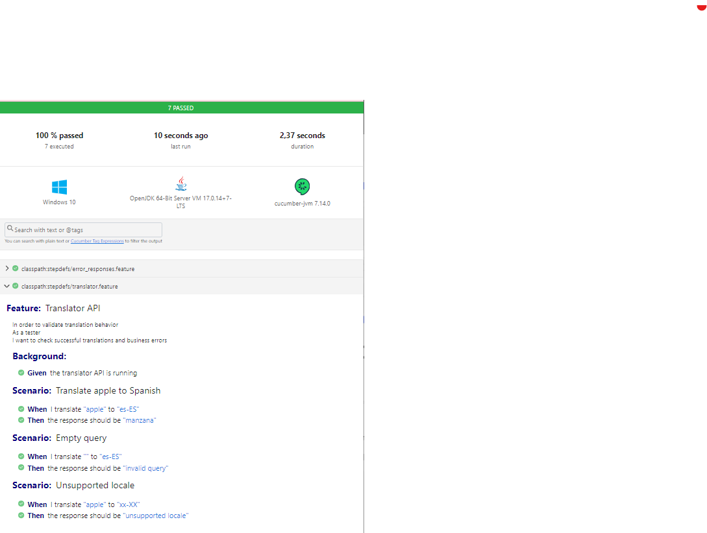

# Translator API – Automated Tests

This repository contains an automated test project for a mocked Translator API, implemented using modern QA/testing technologies:

- Java 17
- Gradle as the build system
- JUnit 5 for test execution
- Cucumber (Gherkin) for BDD (Behavior-Driven Development)
- RestAssured for API test automation
- WireMock for simulating/mocking API endpoints
- SLF4J for logging

The goal of this project is to demonstrate how to design, automate, and document tests for a simple translation API.

## Project Objective

We need to test the following endpoint (simulated via WireMock):

`GET http://localhost:8080/?query=apple&locale=es-ES`

Expected response:

`manzana`

Additional scenarios include empty queries and unsupported locales.

## Project Structure
```
translator-api-tests/
│── build.gradle                  # Gradle dependencies & build configuration
│── settings.gradle               # Gradle project name
│── README.md                     # Project documentation
│
└── src/
    └── test/
        ├── java/
        │   └── stepdefs/
        │       ├── Hooks.java                # Starts WireMock once
        │       ├── TranslatorStepDefs.java   # Step definitions (valid translations)
        │       ├── HttpStatusStepDefs.java   # Step definitions (HTTP status codes)
        │       └── RunCucumberTest.java      # Test runner (entry point)
        │
        └── resources/
            ├── features/
            │   ├── translator.feature        # Translation and business logic scenarios
            │   └── error_responses.feature   # HTTP status code scenarios
            │
            ├── mappings/                     # WireMock endpoint stubs
            │   ├── 200.json
            │   ├── 302.json
            │   ├── 403.json
            │   ├── 404.json
            │   └── 500.json
            │
            └── junit-platform.properties     # Cucumber runtime configuration

```

## Explanation of Components

### 1. Gherkin Feature File (translator.feature)
Defines test scenarios in plain English:

```
Feature: Translator API
  In order to validate translation behavior
  As a tester
  I want to check successful translations and business errors

  Background:
    Given the translator API is running

  Scenario: Translate apple to Spanish
    When I translate "apple" to "es-ES"
    Then the response should be "manzana"
```

### 2. Step Definitions (src/test/java/stepdefs/)
These map Gherkin steps to Java code, using:
RestAssured to make API calls.
WireMock to simulate backend responses.
- REST Assured → make API calls
- WireMock → simulate backend responses


### 3. Hooks (Hooks.java)
Initializes and manages a single shared instance of WireMock server.
Prevents multiple bindings to port 8080 when running multiple features.

### 4. Runner Class (RunCucumberTest.java)
Minimal entry point for executing `.feature` files as tests:
```java
@Cucumber
public class RunCucumberTest {
}
```

### 5. WireMock Mappings (mappings/*.json)
Define API responses without requiring a real backend.

Example:
```json
{
  "request": {
    "method": "GET",
    "urlPath": "/",
    "queryParameters": {
      "query": { "equalTo": "apple" },
      "locale": { "equalTo": "es-ES" }
    }
  },
  "response": {
    "status": 200,
    "headers": { "Content-Type": "text/plain" },
    "body": "manzana"
  }
}
```
### 6. WireMock Mappings (src/test/resources/mappings/)
JSON files defining mocked API endpoints and their responses.
This allows testing without a real backend.

Example (apple-200.json):
```
{
"request": {
"method": "GET",
"urlPath": "/",
"queryParameters": {
"query": { "equalTo": "apple" },
"locale": { "equalTo": "es-ES" }
}
},
"response": {
"status": 200,
"headers": { "Content-Type": "text/plain" },
"body": "manzana"
}
}
```
### 6. junit-platform.properties
Configures Cucumber runtime:
```
cucumber.glue=stepdefs
cucumber.plugin=pretty, html:build/reports/cucumber-report.html, json:build/reports/cucumber-report.json
```

## How to Run the Tests

1. Clone the repository
```
git clone https://github.com/leonardogsu/translator-api-tests.git
cd translator-api-tests
```

2. Run tests with Gradle

Windows (PowerShell):
```
.\gradlew clean test
```

Linux/Mac:
```
./gradlew clean test
```

## Test Reports
After execution, reports will be generated:

- Cucumber HTML Report (./build/reports/cucumber-report.html)
- Cucumber JSON Report (./build/reports/cucumber-report.json)
- JUnit Report (Gradle) (./build/reports/tests/test/index.html)

Note: Links work only after running tests locally.

Reports example:


## Technologies Used
- Java 17 → programming language
- Gradle → build automation tool
- JUnit 5 → testing framework
- Cucumber (BDD) → human-readable test cases in Gherkin
- REST Assured → API testing library
- WireMock → mock HTTP server
- SLF4J + Simple Logger → logging

## Example Scenario Executions
### Successful and Business Logic Responses
- Translate "apple" to Spanish (`es-ES`) → **Response body:** `manzana`
- Translate empty query (`""`) → **Response body:** `invalid query`
- Translate "apple" with unsupported locale (`xx-XX`) → **Response body:** `unsupported locale`

### Error Handling (HTTP Status Codes)
- Translate "banana" to Spanish → **Response status:** `302 Found`
- Translate "restricted" to Spanish → **Response status:** `403 Forbidden`
- Translate "unknown" to Spanish → **Response status:** `404 Not Found`
- Translate "error" to Spanish → **Response status:** `500 Internal Server Error`
